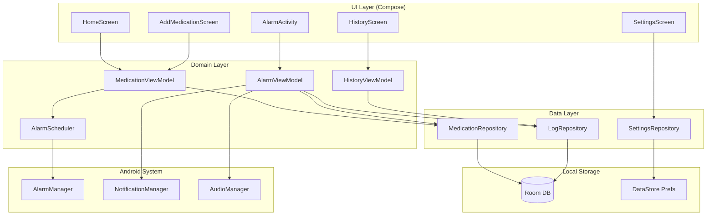

# Architecture — Tabl

## Architecture Style

**Clean Architecture + MVVM** — стандарт для Android с Jetpack Compose.  
**Offline-first** — нет сетевых зависимостей.  
**Single-module** — простое приложение, монолит оправдан.

---

## High-Level Diagram



---

## Component Breakdown

### UI Layer

| Экран | Описание |
|-------|----------|
| `HomeScreen` | Список лекарств с карточками. FAB для добавления. |
| `AddMedicationScreen` | Форма: название, доза, цвет, запас. Вложенный `ScheduleForm`. |
| `AlarmActivity` | Полноэкранный экран будильника. Запускается поверх локскрина. |
| `HistoryScreen` | Лог приёмов с фильтрацией и процентом соблюдения. |
| `SettingsScreen` | Звук, снуз, тема, язык. |

### Domain Layer

| Компонент | Описание |
|-----------|----------|
| `AlarmScheduler` | Управляет регистрацией/отменой будильников в AlarmManager. |
| `MedicationViewModel` | Состояние списка лекарств, CRUD операции. |
| `AlarmViewModel` | Обработка действий пользователя на экране будильника. |
| `HistoryViewModel` | Агрегация логов, расчёт процента соблюдения. |

### Data Layer

| Компонент | Описание |
|-----------|----------|
| `MedicationRepository` | CRUD для Medication и Schedule. |
| `LogRepository` | Запись событий приёма, запросы истории. |
| `SettingsRepository` | Чтение/запись настроек через DataStore. |

### Android Components

| Компонент | Тип | Назначение |
|-----------|-----|-----------|
| `AlarmReceiver` | BroadcastReceiver | Принимает сигнал от AlarmManager, запускает AlarmActivity |
| `BootReceiver` | BroadcastReceiver | BOOT_COMPLETED — восстановление будильников |
| `AlarmActivity` | Activity | Полноэкранный экран подтверждения |
| `AlarmService` | ForegroundService | Управляет звуком и вибрацией во время будильника |

---

## Technology Stack

| Слой | Технология | Версия | Обоснование |
|------|-----------|--------|-------------|
| Язык | Kotlin | 2.0+ | Официальный язык Android |
| UI | Jetpack Compose | 1.7+ | Современный декларативный UI, Material 3 |
| Навигация | Navigation Compose | 2.8+ | Официальная библиотека |
| Архитектура | MVVM + StateFlow | — | Официальный Android паттерн |
| БД | Room | 2.6+ | Типобезопасный SQLite ORM |
| DI | Hilt | 2.51+ | Стандарт Android DI |
| Async | Kotlin Coroutines + Flow | 1.8+ | Реактивные потоки данных |
| Настройки | DataStore Preferences | 1.1+ | Замена SharedPreferences |
| Будильники | AlarmManager | Android API | Точные системные будильники |
| Фон | WorkManager | 2.9+ | Планирование, устойчивое к перезагрузке |
| Тестирование | JUnit5, MockK, Espresso | — | Unit + Integration тесты |
| Min SDK | API 26 | Android 8.0 | Охват 97%+ устройств |
| Target SDK | API 35 | Android 15 | Актуальная версия |

---

## Database Schema

```sql
CREATE TABLE medications (
    id INTEGER PRIMARY KEY AUTOINCREMENT,
    name TEXT NOT NULL,
    dose TEXT,
    color_index INTEGER NOT NULL DEFAULT 0,
    stock_count INTEGER,
    stock_threshold INTEGER,
    is_active INTEGER NOT NULL DEFAULT 1,
    created_at INTEGER NOT NULL
);

CREATE TABLE schedules (
    id INTEGER PRIMARY KEY AUTOINCREMENT,
    medication_id INTEGER NOT NULL REFERENCES medications(id) ON DELETE CASCADE,
    time_hour INTEGER NOT NULL,       -- 0-23
    time_minute INTEGER NOT NULL,     -- 0-59
    days_of_week TEXT NOT NULL,       -- JSON: [1,2,3] или [] = каждый день
    start_date TEXT,                  -- ISO date "2026-04-16" или null
    end_date TEXT                     -- ISO date или null
);

CREATE TABLE medication_logs (
    id INTEGER PRIMARY KEY AUTOINCREMENT,
    medication_id INTEGER NOT NULL REFERENCES medications(id) ON DELETE CASCADE,
    schedule_id INTEGER NOT NULL,
    scheduled_at INTEGER NOT NULL,    -- timestamp запланированного приёма
    action_at INTEGER,                -- timestamp действия пользователя
    status TEXT NOT NULL,             -- 'TAKEN'|'MISSED'|'SNOOZED'|'SKIPPED'
    snooze_count INTEGER NOT NULL DEFAULT 0
);

CREATE INDEX idx_logs_medication_date 
    ON medication_logs(medication_id, scheduled_at);
```

---

## Alarm Architecture Detail

```
Scheduled time arrives
        ↓
AlarmManager → AlarmReceiver (BroadcastReceiver)
        ↓
AlarmReceiver:
  1. acquires WakeLock (30 sec)
  2. starts AlarmService (ForegroundService)
  3. launches AlarmActivity (FLAG_SHOW_WHEN_LOCKED | FLAG_TURN_SCREEN_ON)
        ↓
AlarmService:
  - plays alarm sound (AudioManager, STREAM_ALARM)
  - FLAG_INSISTENT = repeats until stopped
  - vibration pattern
        ↓
AlarmActivity:
  - shows medication name, dose, time
  - buttons: Принял / Снуз / Пропустить
  - on user action → calls AlarmViewModel → stops AlarmService
        ↓
AlarmViewModel:
  - updates MedicationLog
  - calls AlarmScheduler.scheduleNext()
```

---

## Permissions Required

```xml
<!-- Точные будильники (API 31+) -->
<uses-permission android:name="android.permission.SCHEDULE_EXACT_ALARM" />

<!-- Пробуждение устройства -->
<uses-permission android:name="android.permission.WAKE_LOCK" />

<!-- Восстановление после перезагрузки -->
<uses-permission android:name="android.permission.RECEIVE_BOOT_COMPLETED" />

<!-- Уведомления (API 33+) -->
<uses-permission android:name="android.permission.POST_NOTIFICATIONS" />

<!-- Фоновый сервис -->
<uses-permission android:name="android.permission.FOREGROUND_SERVICE" />
<uses-permission android:name="android.permission.FOREGROUND_SERVICE_MEDIA_PLAYBACK" />

<!-- Игнорировать оптимизацию батареи (запрос у пользователя) -->
<uses-permission android:name="android.permission.REQUEST_IGNORE_BATTERY_OPTIMIZATIONS" />
```

---

## Security Architecture

- Нет сетевых запросов → нет attack surface для MITM
- Нет аккаунта → нет credentials для кражи
- Room DB хранится в app-private storage (недоступен без root)
- Нет sensitive данных в логах (только medicationId, без названий)

---

## Scalability Considerations

Приложение offline-first, нет серверной части — масштабирование не требуется.  
Room DB с SQLite эффективно обрабатывает тысячи записей истории.  
AlarmManager ограничен системой: оптимально ≤500 активных будильников (реально у пользователя 1-20).
