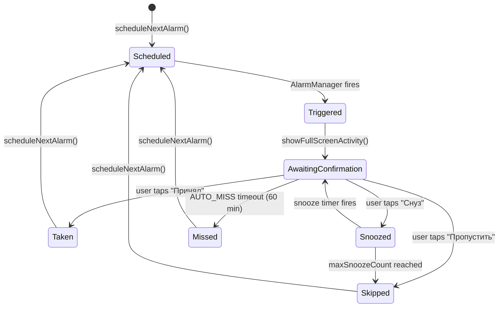

# Pseudocode — Tabl

## Core Algorithms

---

### Algorithm 1: Планирование будильника

```
FUNCTION scheduleNextAlarm(medicationId, scheduleId):
  INPUT: medicationId: Long, scheduleId: Long
  OUTPUT: Unit (будильник зарегистрирован в AlarmManager)

  schedule = db.schedules.findById(scheduleId)
  medication = db.medications.findById(medicationId)
  
  IF medication.isActive == false: RETURN
  IF schedule.endDate != null AND today > schedule.endDate: RETURN
  
  nextTriggerTime = calculateNextTrigger(schedule)
  
  IF nextTriggerTime == null: RETURN  // расписание истекло
  
  alarmIntent = createAlarmIntent(medicationId, scheduleId, nextTriggerTime)
  alarmManager.setExactAndAllowWhileIdle(
    type = RTC_WAKEUP,
    triggerAtMillis = nextTriggerTime,
    pendingIntent = alarmIntent
  )
  
  db.pendingAlarms.upsert(PendingAlarm(
    medicationId, scheduleId, nextTriggerTime
  ))

COMPLEXITY: O(1)
```

---

### Algorithm 2: Вычисление следующего времени срабатывания

```
FUNCTION calculateNextTrigger(schedule: Schedule): Long?
  INPUT: schedule с timeHour, timeMinute, daysOfWeek, startDate, endDate
  OUTPUT: timestamp следующего срабатывания или null

  now = currentTimestamp()
  candidateTime = today at schedule.timeHour:schedule.timeMinute
  
  IF candidateTime <= now:
    candidateTime = candidateTime + 1 day
  
  FOR attempt IN 0..6:
    date = candidateTime.date
    
    IF schedule.startDate != null AND date < schedule.startDate:
      candidateTime = candidateTime + 1 day
      CONTINUE
    
    IF schedule.endDate != null AND date > schedule.endDate:
      RETURN null  // курс завершён
    
    dayOfWeek = candidateTime.dayOfWeek  // 1=пн..7=вс
    
    IF schedule.daysOfWeek.isEmpty() OR dayOfWeek IN schedule.daysOfWeek:
      RETURN candidateTime.toMillis()
    
    candidateTime = candidateTime + 1 day
  
  RETURN null  // не нашли подходящий день в ближайшую неделю

COMPLEXITY: O(7) = O(1)
```

---

### Algorithm 3: Обработка срабатывания будильника

```
FUNCTION onAlarmTriggered(medicationId, scheduleId, scheduledTime):
  INPUT: параметры из AlarmManager Intent
  OUTPUT: отображён экран подтверждения

  medication = db.medications.findById(medicationId)
  
  IF medication == null OR medication.isActive == false:
    RETURN  // лекарство удалено/приостановлено
  
  // Создать лог со статусом SNOOZED (будет обновлён)
  logId = db.logs.insert(MedicationLog(
    medicationId = medicationId,
    scheduleId = scheduleId,
    scheduledAt = scheduledTime,
    status = SNOOZED,
    snoozeCount = 0
  ))
  
  // Показать полноэкранный Intent
  showFullScreenAlarmActivity(medicationId, scheduleId, logId, scheduledTime)
  
  // Запустить звук с FLAG_INSISTENT (повторяется непрерывно)
  audioManager.startAlarmSound(flags = FLAG_INSISTENT)
  
  // Запланировать авто-пропуск через AUTO_MISS_MINUTES (по умолчанию 60 мин)
  scheduleAutoMiss(logId, scheduledTime + AUTO_MISS_MINUTES)

SIDE EFFECTS: звук, вибрация, показ Activity
```

---

### Algorithm 4: Подтверждение приёма пользователем

```
FUNCTION onUserAction(action: UserAction, logId: Long, medicationId: Long):
  INPUT: action = TAKEN | SNOOZED(minutes) | SKIPPED
  OUTPUT: обновлён лог, остановлен будильник, запланирован следующий

  // Остановить звук и вибрацию
  audioManager.stopAlarmSound()
  
  // Отменить авто-пропуск
  cancelAutoMiss(logId)
  
  log = db.logs.findById(logId)
  
  SWITCH action:
    CASE TAKEN:
      db.logs.update(log.copy(
        status = TAKEN,
        actionAt = currentTimestamp()
      ))
      // Уменьшить счётчик таблеток
      IF medication.stockCount != null:
        db.medications.decrementStock(medicationId)
        checkStockThreshold(medicationId)
    
    CASE SNOOZED(minutes):
      IF log.snoozeCount >= settings.maxSnoozeCount:
        // Достигнут лимит снузов — отмечаем как пропущено
        db.logs.update(log.copy(status = SKIPPED, actionAt = now))
      ELSE:
        db.logs.update(log.copy(
          status = SNOOZED,
          snoozeCount = log.snoozeCount + 1
        ))
        // Перепланировать будильник через N минут
        snoozeTime = currentTimestamp() + minutes * 60_000
        alarmManager.setExactAndAllowWhileIdle(RTC_WAKEUP, snoozeTime, ...)
    
    CASE SKIPPED:
      db.logs.update(log.copy(
        status = SKIPPED,
        actionAt = currentTimestamp()
      ))
  
  // Запланировать следующий обычный будильник
  IF action != SNOOZED:
    scheduleNextAlarm(medicationId, log.scheduleId)
  
  // Закрыть экран подтверждения
  closeAlarmActivity()
```

---

### Algorithm 5: Проверка порога запасов

```
FUNCTION checkStockThreshold(medicationId):
  INPUT: medicationId
  OUTPUT: уведомление если запас низкий

  medication = db.medications.findById(medicationId)
  
  IF medication.stockCount == null OR medication.stockThreshold == null:
    RETURN
  
  IF medication.stockCount <= medication.stockThreshold:
    notificationManager.showLowStockNotification(
      title = "Заканчиваются таблетки",
      text = "Осталось ${medication.stockCount} шт. ${medication.name}",
      importance = IMPORTANCE_DEFAULT  // обычное, не настойчивое
    )
```

---

### Algorithm 6: Восстановление будильников после перезагрузки

```
FUNCTION onBootCompleted():
  INPUT: BOOT_COMPLETED broadcast
  OUTPUT: все активные будильники переназначены

  activeMedications = db.medications.findAllActive()
  
  FOR medication IN activeMedications:
    schedules = db.schedules.findByMedicationId(medication.id)
    
    FOR schedule IN schedules:
      // Проверяем есть ли пропущенные будильники во время перезагрузки
      missedAlarms = findMissedAlarmsDuringBoot(schedule)
      
      FOR missed IN missedAlarms:
        db.logs.insert(MedicationLog(
          medicationId = medication.id,
          scheduleId = schedule.id,
          scheduledAt = missed.time,
          status = MISSED
        ))
      
      // Запланировать следующий
      scheduleNextAlarm(medication.id, schedule.id)

COMPLEXITY: O(medications × schedules)
```

---

## State Transitions



---

## Error Handling Strategy

| Ситуация | Обработка |
|----------|----------|
| AlarmManager.setExact бросает SecurityException (API 31+, нет разрешения) | Fallback: setInexactRepeating + показ диалога с просьбой дать разрешение |
| Room DB IOException при записи лога | Retry 3 раза с exponential backoff, затем silent fail (лог теряется, но будильник продолжает работу) |
| FullScreenActivity не открывается (MIUI/OneUI ограничения) | Показ heads-up уведомления как fallback |
| medicationId в Intent не найден в БД | Тихое завершение без краша |
| Одновременно 2+ будильника в одно время | Каждый alarm имеет уникальный requestCode = scheduleId, обрабатываются последовательно |
