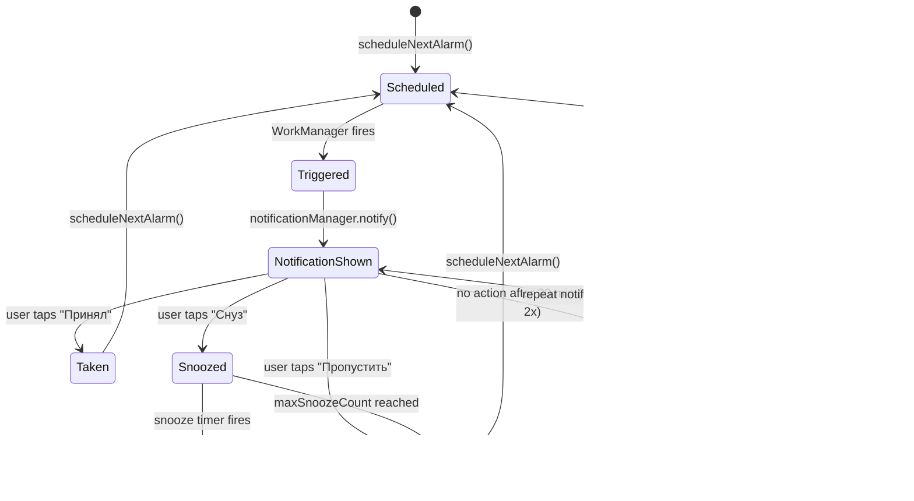

# Pseudocode — Tabl

## Core Algorithms

---

### Algorithm 1: Планирование push-уведомления через WorkManager

```
FUNCTION scheduleNextNotification(medicationId, scheduleId):
  INPUT: medicationId: Long, scheduleId: Long
  OUTPUT: Unit (WorkManager задача поставлена в очередь)

  schedule = db.schedules.findById(scheduleId)
  medication = db.medications.findById(medicationId)
  
  IF medication.isActive == false: RETURN
  IF schedule.endDate != null AND today > schedule.endDate: RETURN
  
  nextTriggerTime = calculateNextTrigger(schedule)
  IF nextTriggerTime == null: RETURN
  
  delayMillis = nextTriggerTime - currentTimestamp()
  
  workRequest = OneTimeWorkRequestBuilder<MedicationReminderWorker>()
    .setInitialDelay(delayMillis, MILLISECONDS)
    .setInputData(workDataOf(
      "medicationId" to medicationId,
      "scheduleId" to scheduleId,
      "scheduledAt" to nextTriggerTime
    ))
    .addTag("med_${scheduleId}")
    .build()
  
  workManager.enqueueUniqueWork(
    uniqueName = "reminder_${scheduleId}",
    existingWorkPolicy = REPLACE,
    request = workRequest
  )

COMPLEXITY: O(1)
```

---

### Algorithm 2: Вычисление следующего времени срабатывания

```
FUNCTION calculateNextTrigger(schedule: Schedule): Long?
  INPUT: schedule с timeHour, timeMinute, daysOfWeek, startDate, endDate
  OUTPUT: timestamp следующего срабатывания или null

  now = currentTimestamp()
  candidateTime = today at schedule.timeHour:schedule.timeMinute
  
  IF candidateTime <= now:
    candidateTime = candidateTime + 1 day
  
  FOR attempt IN 0..6:
    date = candidateTime.date
    
    IF schedule.startDate != null AND date < schedule.startDate:
      candidateTime = candidateTime + 1 day
      CONTINUE
    
    IF schedule.endDate != null AND date > schedule.endDate:
      RETURN null  // курс завершён
    
    dayOfWeek = candidateTime.dayOfWeek  // 1=пн..7=вс
    
    IF schedule.daysOfWeek.isEmpty() OR dayOfWeek IN schedule.daysOfWeek:
      RETURN candidateTime.toMillis()
    
    candidateTime = candidateTime + 1 day
  
  RETURN null  // не нашли подходящий день в ближайшую неделю

COMPLEXITY: O(7) = O(1)
```

---

### Algorithm 3: Показ heads-up push-уведомления (MedicationReminderWorker)

```
FUNCTION doWork(medicationId, scheduleId, scheduledTime):
  INPUT: параметры из WorkManager InputData
  OUTPUT: показано heads-up уведомление с кнопками действий

  medication = db.medications.findById(medicationId)
  
  IF medication == null OR medication.isActive == false:
    RETURN Result.success()  // лекарство удалено/приостановлено
  
  // Создать лог
  logId = db.logs.insert(MedicationLog(
    medicationId = medicationId,
    scheduleId = scheduleId,
    scheduledAt = scheduledTime,
    status = MISSED,  // будет обновлён при действии пользователя
    snoozeCount = 0
  ))
  
  // Собрать PendingIntent для каждой кнопки
  takenIntent  = broadcastPendingIntent(ACTION_TAKEN,  logId, medicationId, scheduleId)
  snoozeIntent = broadcastPendingIntent(ACTION_SNOOZE, logId, medicationId, scheduleId)
  skipIntent   = broadcastPendingIntent(ACTION_SKIP,   logId, medicationId, scheduleId)
  
  // Построить уведомление
  notification = NotificationCompat.Builder(context, CHANNEL_REMINDERS)
    .setContentTitle(medication.name)
    .setContentText("${medication.dose ?: ""} — время принять")
    .setPriority(PRIORITY_HIGH)        // heads-up
    .setAutoCancel(true)
    .addAction("✅ Принял", takenIntent)
    .addAction("⏰ Снуз",   snoozeIntent)
    .addAction("✗ Пропустить", skipIntent)
    .setContentIntent(openMainActivityIntent(medicationId))
    .build()
  
  notificationManager.notify(scheduleId.toInt(), notification)
  
  // Запланировать авто-повтор через REPEAT_MINUTES если нет ответа
  scheduleRepeatIfNoAction(logId, scheduleId, medicationId, repeatCount = 0)
  
  RETURN Result.success()

SIDE EFFECTS: показ уведомления, запись лога
```

---

### Algorithm 4: Обработка действия из уведомления (NotificationActionReceiver)

```
FUNCTION onUserAction(action: UserAction, logId: Long, medicationId: Long, scheduleId: Long):
  INPUT: action = TAKEN | SNOOZED(minutes) | SKIPPED  (из BroadcastReceiver)
  OUTPUT: обновлён лог, уведомление убрано, запланировано следующее

  // Убрать уведомление
  notificationManager.cancel(scheduleId.toInt())
  
  // Отменить авто-повтор
  workManager.cancelUniqueWork("repeat_${logId}")
  
  log = db.logs.findById(logId)
  
  SWITCH action:
    CASE TAKEN:
      db.logs.update(log.copy(
        status = TAKEN,
        actionAt = currentTimestamp()
      ))
      // Уменьшить счётчик таблеток
      IF medication.stockCount != null:
        db.medications.decrementStock(medicationId)
        checkStockThreshold(medicationId)
    
    CASE SNOOZED(minutes):
      IF log.snoozeCount >= settings.maxSnoozeCount:
        db.logs.update(log.copy(status = SKIPPED, actionAt = now))
      ELSE:
        db.logs.update(log.copy(
          status = SNOOZED,
          snoozeCount = log.snoozeCount + 1
        ))
        // Поставить в очередь Worker со снузом
        snoozeWork = OneTimeWorkRequestBuilder<MedicationReminderWorker>()
          .setInitialDelay(minutes.toLong(), MINUTES)
          .setInputData(workDataOf(
            "medicationId" to medicationId,
            "scheduleId" to scheduleId,
            "scheduledAt" to log.scheduledAt,
            "isSnooze" to true
          ))
          .addTag("snooze_${logId}")
          .build()
        workManager.enqueueUniqueWork("snooze_${logId}", REPLACE, snoozeWork)
    
    CASE SKIPPED:
      db.logs.update(log.copy(
        status = SKIPPED,
        actionAt = currentTimestamp()
      ))
  
  // Запланировать следующее обычное уведомление
  IF action != SNOOZED:
    scheduleNextNotification(medicationId, log.scheduleId)
```

---

### Algorithm 5: Проверка порога запасов

```
FUNCTION checkStockThreshold(medicationId):
  INPUT: medicationId
  OUTPUT: уведомление если запас низкий

  medication = db.medications.findById(medicationId)
  
  IF medication.stockCount == null OR medication.stockThreshold == null:
    RETURN
  
  IF medication.stockCount <= medication.stockThreshold:
    notificationManager.showLowStockNotification(
      title = "Заканчиваются таблетки",
      text = "Осталось ${medication.stockCount} шт. ${medication.name}",
      importance = IMPORTANCE_DEFAULT  // обычное, не настойчивое
    )
```

---

### Algorithm 6: Восстановление будильников после перезагрузки

```
FUNCTION onBootCompleted():
  INPUT: BOOT_COMPLETED broadcast
  OUTPUT: все активные будильники переназначены

  activeMedications = db.medications.findAllActive()
  
  FOR medication IN activeMedications:
    schedules = db.schedules.findByMedicationId(medication.id)
    
    FOR schedule IN schedules:
      // Проверяем есть ли пропущенные будильники во время перезагрузки
      missedAlarms = findMissedAlarmsDuringBoot(schedule)
      
      FOR missed IN missedAlarms:
        db.logs.insert(MedicationLog(
          medicationId = medication.id,
          scheduleId = schedule.id,
          scheduledAt = missed.time,
          status = MISSED
        ))
      
      // Запланировать следующее
      scheduleNextNotification(medication.id, schedule.id)

COMPLEXITY: O(medications × schedules)
```

---

## State Transitions



---

## Error Handling Strategy

| Ситуация | Обработка |
|----------|----------|
| AlarmManager.setExact бросает SecurityException (API 31+, нет разрешения) | Fallback: setInexactRepeating + показ диалога с просьбой дать разрешение |
| Room DB IOException при записи лога | Retry 3 раза с exponential backoff, затем silent fail (лог теряется, но будильник продолжает работу) |
| FullScreenActivity не открывается (MIUI/OneUI ограничения) | Показ heads-up уведомления как fallback |
| medicationId в Intent не найден в БД | Тихое завершение без краша |
| Одновременно 2+ будильника в одно время | Каждый alarm имеет уникальный requestCode = scheduleId, обрабатываются последовательно |
